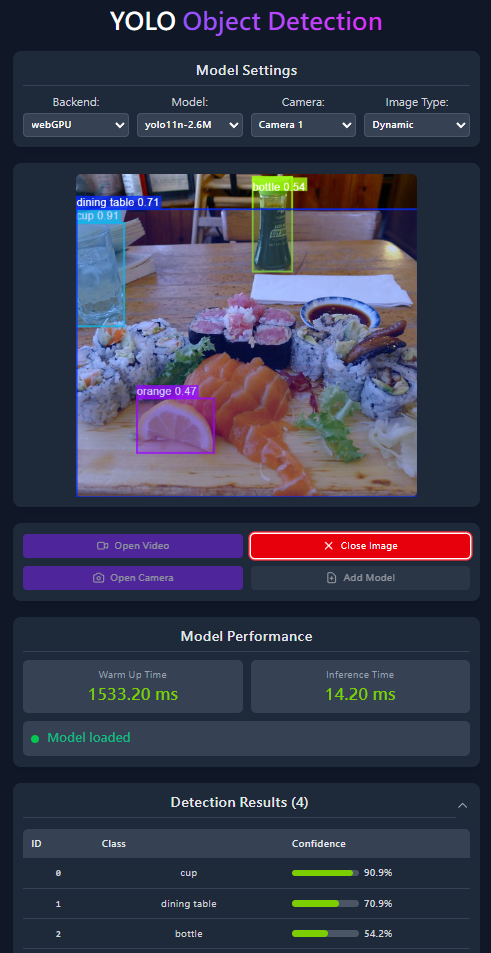

# 🚀 Object Detection Web App

<div align="center">


<br>

[](https://onnxruntime.ai/)
[](https://github.com/ultralytics/ultralytics)
[](LICENSE)

</div>

## 📖 Introduction

This web application, built on **ONNX Runtime Web**, brings the power of YOLO object detection directly to your browser. It supports full client-side inference without sending data to a server, offering privacy and low latency.

## ⚠️ WebGPU Prerequisites (Important)

To achieve the best performance using **WebGPU**, please ensure the following:

1.  **Browser**: Use a Chromium-based browser (Chrome, Edge, Brave).
2.  **Enable Flags**:
    - Type `chrome://flags` (or `edge://flags`) in your address bar.
    - Search for **"Unsafe WebGPU Support"** and set it to **Enabled**.
    - **(Linux / Android users)**: Search for **"Vulkan"** (`#enable-vulkan`) and set it to **Enabled**.
    - Relaunch your browser.

> 💡 **Note**: If WebGPU is not available, the app will automatically fall back to WASM (CPU), which is slower but universally compatible.

## ✨ Features

- 🔍 **Object Detection** - Precisely identify and locate various objects in real-time.
- ⚡ **High Performance** - Powered by WebGPU acceleration.
- 🔒 **Privacy First** - All processing happens locally on your device.

## 📹 Input Support

| Input Type         |  Format  | Use Case                                  |
| :----------------- | :------: | :---------------------------------------- |
| 📷 **Image**       | JPG, PNG | Single image analysis & batch processing. |
| 📹 **Video**       |   MP4    | Offline video analysis & content review.  |
| 📺 **Live Camera** |  Stream  | Real-time monitoring & interactive demos. |

## 📊 Supported Models

| Model        | Input Size | Params | Recommended For       |
| :----------- | :--------- | :----- | :-------------------- |
| **YOLO11-N** | 640        | 2.6M   | 📱 Mobile / Real-time |
| **YOLO11-S** | 640        | 9.4M   | 🖥️ High Accuracy      |
| **YOLO11-M** | 640        | 20.1M  | 🖥️ Higher Accuracy    |
| **YOLO12-N** | 640        | 2.6M   | 📱 Mobile / Real-time |
| **YOLO12-S** | 640        | 9.3M   | 🖥️ High Accuracy      |

_Models are licensed under [AGPL-3.0](./public/models/LICENSE.txt) via [Ultralytics](https://github.com/ultralytics/ultralytics)._

## 🛠️ Installation

1. **Clone the repository**

   ```bash
   git clone https://github.com/nomi30701/yolo-object-detection-onnxruntime-web.git
   ```

2. **Navigate to project directory**

   ```bash
   cd yolo-object-detection-onnxruntime-web
   ```

3. **Install dependencies**

   ```bash
   yarn install
   ```

4. **Run Development Server**

   ```bash
   yarn dev
   ```

5. **Build for Production**
   ```bash
   yarn build
   ```

## 🔧 Custom Models Guide

You can run your own YOLO models in this app.

### Step 1: Export to ONNX

Use Ultralytics to export your model. **Crucial:** Use `opset=12` for WebGPU compatibility.

```python
from ultralytics import YOLO

model = YOLO("path/to/your/model.pt")
# Export with opset=12 and dynamic shape
model.export(format="onnx", opset=12, dynamic=True)
```

### Step 2: Load your Model

You have two ways to load your model:

#### Option A: Quick Test (UI Upload)

Simply click the **"Add model"** button in the web interface to upload your `.onnx` file temporarily.

#### Option B: Permanent Integration (Code)

1. Copy your `.onnx` file to `./public/models/`.
2. Edit `App.jsx` to add your model to the list:

```jsx
<select name="model-selector">
  <option value="yolo11n">YOLO11n (2.6M)</option>
  <option value="your-custom-model">Your Custom Model</option>
</select>
```

### Step 3: Update Classes

If your model uses custom classes (not COCO), you need to update the class definitions:

- **UI Method**: Click **"Add Classes.json"** to upload a JSON file mapping class IDs to names.
- **Code Method**: Update `src/utils/yolo_classes.json`.

```json
{
  "class": {
    "0": "person",
    "1": "bicycle"
  }
}
```

## ⚙️ Configuration: Image Processing

You can control how images are pre-processed via the `imgsz_type` setting:

- **Dynamic (Default)**:
  - Uses the original image aspect ratio.
  - **Pros**: Best accuracy.
  - **Cons**: Slower on large images; inference time varies.
  - _Requires model exported with `dynamic=True`._

- **Zero Pad (Square)**:
  - Pads image to square and resizes to 640x640.
  - **Pros**: Consistent, faster speed suitable for real-time video.
  - **Cons**: Slight accuracy drop on small objects due to scaling.

## ⚙️ Technical Details: Coordinate System Handling

To ensure consistent bounding boxes across all devices, the following strategy is adopted:

1.  **Inference**: Input is resized to the model's tensor shape (e.g., 640x640).
2.  **Mapping**: Detected coordinates are projected back to the image's **intrinsic (natural) resolution** rather than the current HTML display size.
3.  **Rendering**: The overlay `<canvas>` is set to the source image's true resolution. Visual alignment is handled entirely via CSS, eliminating the need for complex resize event listeners and ensuring high-DPI clarity.
